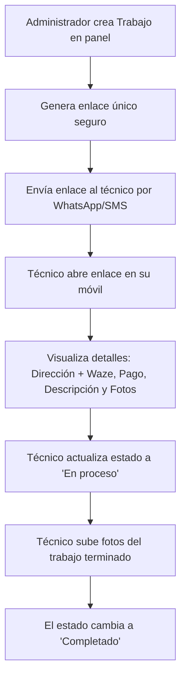

# Análisis de Requerimientos y Propuesta Visual: P&C PROPERTY IMPROVEMENT LLC

Este documento resume la información recopilada del documento `Notes_260711_100518.docx` y establece la base para comenzar a construir la maqueta del sitio web y el portal móvil de técnicos.

---

## 📋 Resumen del Proyecto

* **Nombre de la Empresa:** P&C PROPERTY IMPROVEMENT LLC
* **Ubicación:** Atlanta, USA (Área metropolitana)
* **Público Objetivo:** Administradores de apartamentos y subcontratistas.
* **Idioma:** Bilingüe (Inglés / Español)
* **Dominio & Hosting:** A adquirir (requiere asesoramiento)

---

## 🎨 Propuesta de Identidad Visual (Branding)

Dado que la empresa no cuenta con colores definidos, te propongo una paleta moderna, corporativa y confiable:
* 🟦 **Azul Marino Profundo (Navy Blue):** Transmite profesionalismo, estabilidad y confianza en el mercado estadounidense.
* 🟧 **Naranja Cálido/Cobre (Accent Orange):** Ideal para acentuar botones de llamada a la acción (CTA) y evoca acción, reformas y herramientas.
* ⬛ **Gris Carbón (Charcoal) y Blanco:** Para una estructura limpia, elegante y de fácil lectura.

### Comparativa de Logotipo (Original vs. Propuesta de Refresh)

Aquí tienes una comparativa del logotipo actual de la empresa (extraído de `logo.jpeg`) frente a la propuesta de rediseño moderno (Refresh) que he preparado:

````carousel

<!-- slide -->

````

---

## 🖥️ Estructura de la Web Pública (Mockup)

Para la página principal pública, implementaremos:
1. **Navegación:** Selector de idioma (EN/ES), Enlaces a servicios, Galería y Contacto.
2. **Sección Hero:** Slider interactivo de "Antes y Después" (Before & After) con trabajos reales.
3. **Sección de Servicios (14 Especialidades):**
   * Pintura (Interior/Exterior), Drywall, Framer, Fences (Fems), Deck, Trash out, Plomería, Tiles, Floor, Pressure washing, Cabinet, Roof, Wood y Clean.
4. **Formulario de Contacto Dinámico:** Con opción de subir fotos del daño. Al enviar, abrirá un mensaje pre-redactado de WhatsApp y enviará una notificación por correo a `Pc.propertyimprovement@gmail.com`.

### Vista de Maqueta de la Página Principal (Home Mockup)
Así luciría el diseño general del sitio:


---

## 📱 Portal Móvil para Técnicos (Flujo Simple - Opción A)

Según las respuestas, implementaremos el flujo **sin inicio de sesión obligatorio** para los técnicos (ideal para la usabilidad en campo):



---

## 🚀 Próximos Pasos

1. **Alineación con el Cliente:** Presentar este análisis junto con el logo y la maqueta visual para aprobación.
2. **Definición de Tecnologías:** Estructuraremos la maqueta en HTML/CSS Vanilla para máxima flexibilidad.
3. **Inicio de Codificación:** Comenzaremos a estructurar la página de inicio bilingüe y el slider.
